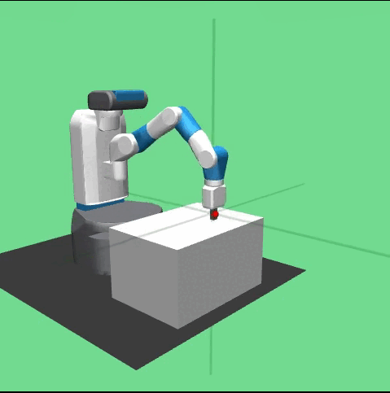
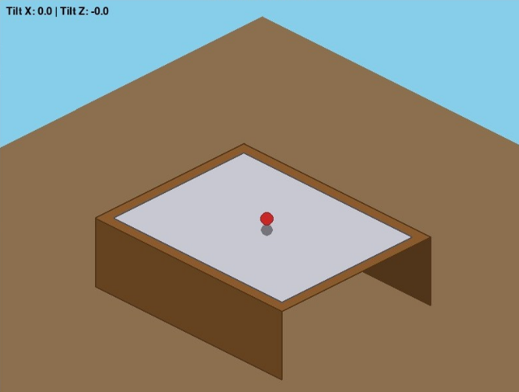

# 🧠 Reinforcement Learning Control Agent

This project demonstrates **end-to-end Reinforcement Learning (RL)** applied to **robotic manipulation** and **continuous control systems**.  
It is divided into two major parts, each targeting a different class of RL problems:  
1) **Robot arm reaching using Gymnasium Robotics**  
2) **Custom control system design using RL (Ball–Plate Balancing)**  

The goal of this project is to build a strong foundation in **environment design, algorithm application, and control-oriented learning**.

---

## 📌 Part 1: FetchReach — Robotic Manipulation with RL

<p align="center">
  
</p>

In this part, reinforcement learning algorithms are applied to the **FetchReach** environment from **Gymnasium Robotics**.  
The task requires controlling a simulated robotic arm in a **continuous action space** so that its end-effector reaches a target position.

### What this part covers:
- Working with a **robotic manipulation environment**
- Continuous state and action spaces
- Applying and experimenting with **multiple RL algorithms**
- Reward design and observation handling
- Studying learning stability and convergence behavior

### What the agent learns:
- How to move a robot arm smoothly in 3D space  
- How to minimize distance to a goal using learned policies  
- How different algorithms behave in manipulation tasks  

This part builds intuition for **robotics-focused RL** and is directly relevant to real-world robotic control problems.

---

## ⚙️ Part 2: Ball–Plate Balancing — Custom Continuous Control Environment

<p align="center">
  
</p>

The second part focuses on **environment design from scratch** using a classic control problem: **ball–plate balancing**.  
The agent controls the tilt of a plate along two axes to keep a ball balanced near the center.

### Environment design:
- Interactive environment
- Custom physics-based dynamics
- Continuous observation and action spaces
- Reward function encouraging stability and smooth control
- Termination conditions based on control failure

### What this part emphasizes:
- Designing RL environments from first principles
- Control-oriented reward shaping
- Handling nonlinear system dynamics
- Training agents for **stable continuous control**

This task highlights the challenges of **learning-based control** and bridges RL with classical control concepts.

---

## 🧪 Tools & Technologies
- **Python**
- **Gymnasium & Gymnasium Robotics**
- **PyTorch**
- Custom RL training loops and environments

---

## 🎯 Key Learning Outcomes
- Hands-on experience with **robotic manipulation RL**
- Designing and training agents in **continuous control settings**
- Building **custom RL environments** from scratch
- Understanding stability, convergence, and reward design
- Developing complete RL pipelines end-to-end

---

## 📁 Project Structure (High Level)
```
RL-Final-Project/
│── Resource/                 # Images and Videos of environments
│── part-1/                   # FetchReach experiments and codes
│── part-2/Custom Env/        # Custom ball–plate environment and codes
│── README.md
```

---

## 🚀 Summary
This project combines **robotics, control systems, and reinforcement learning** into a unified learning experience.  
It showcases the ability to **apply RL to existing robotic environments** as well as **design and solve new control problems**, making it a strong foundation for advanced work in **robotics and Physical AI**.

---

## 👨‍💻 Author

[**Arnab Singha**](https://arnabsingha200228.github.io/), *Computer Science department*, [RKMVERI](https://rkmvu.ac.in/).

---
